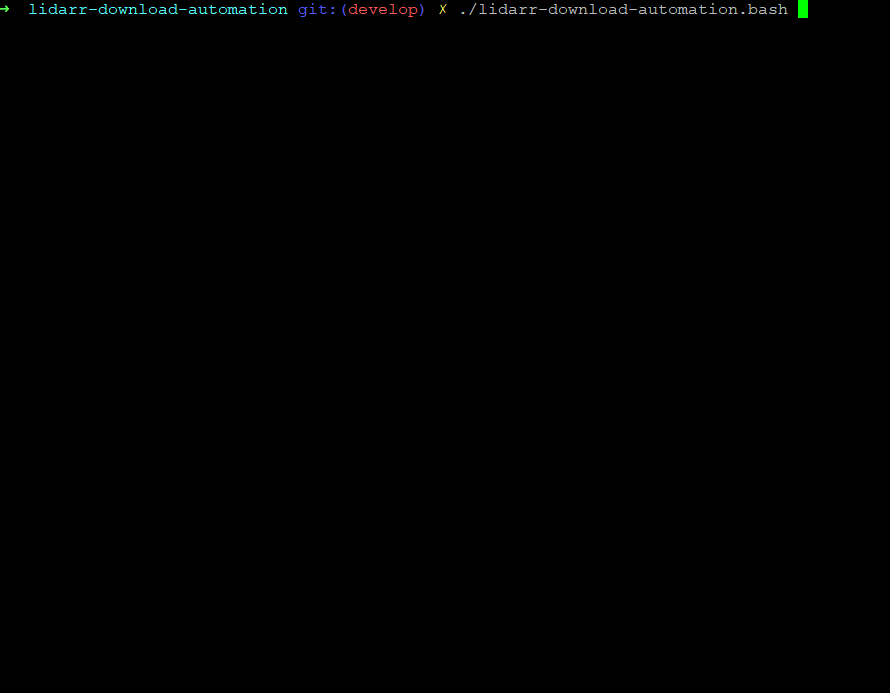

# lidarr-download-automation
Bash script to download your artists that have been added to Lidarr using SMLoadr or d-fi.  

The script communicates with Lidarr over it's API to find get a list of your Artists/Albums, using this data it then searches Deezer for a matching Artist/Album and downloads what it finds.  

This script runs externally to Lidarr and isn't added anywhere to Lidarr, instead you add Lidarrs info to the config file and run this script directly.

Please check the wiki for more information.

# Demo

# Credit
Original Script: Myself 
Improvements: [permutationalparody](https://github.com/permutationalparody) 

[RandomNinjaAtk](https://github.com/RandomNinjaAtk) is now the main developer, his coding skills are taking this script far beyond what i could manage. 
